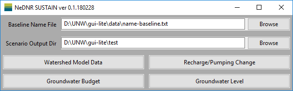
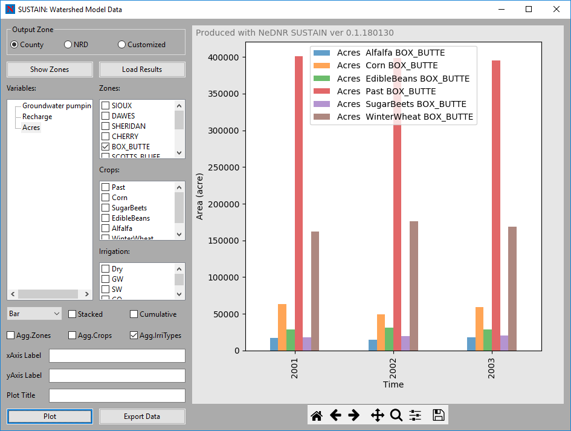
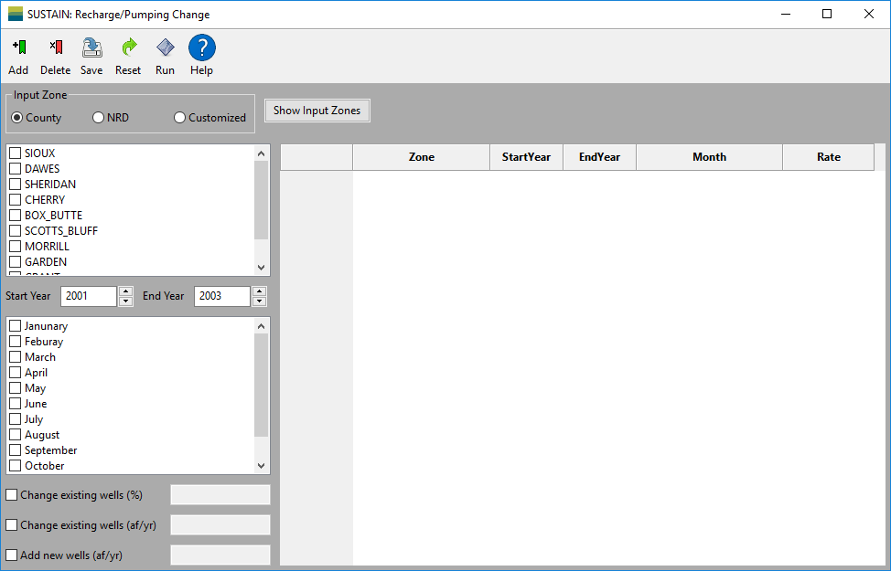

Customized
# Sustainable Use Scenario Tool for Analysis and Informing Nebraskans (*SUSTAIN*)

## Introduction

### Installing SUSTAIN

## Main Window
The ``Main`` window is the first window that appears when the application starts. The settings ``Baseline Name File`` and ``Scenario Output Dir`` need to be specified to open other windows.

* ``Baseline Name File`` is the file path of the model master file, which includes the information to run the models.
* ``Scenario Output Dir`` defines the output directory of the current analysis. All the new model input files output files will be placed in this directory. If the model is completed, *SUSTAIN* will read the model results in this directory.

When the ``Main`` window starts, it reads a configuration file ``config.ini`` in the same directory of the application. The configuration file includes the saved settings of ``Baseline Name File`` and ``Scenario Output Dir``.

There are four buttons in the ``Main`` window. Each button will open a new window with different functions. These windows are introduced as follows.

When the ``Main`` window is closed, a dialog window will pop up to provide the option to save the current settings to the configuration file. Though it is not recommended, experienced user can also modify the ``config.ini`` file using text editing tools.

## Watershed Model Data Window
The ``Watershed Model Data`` window shows watershed model data including land use, and groundwater pumping and recharge estimated with the watershed model ``CropSim``.

* **Data area**
  * ``Output Zone`` select the spatial division of the data to be plotted. For example, if the *NRD* option is selected, the model results are aggregated in each NRD. The customized zone allows users select an existing zone file or shapefiles to define the output zone. Please see the Customized Zone section.
  * ``Show Zones`` activate a new window displaying the distribution map of the selected output zones.
  * ``Load Results`` load the results from the model files and calculate the pumping, recharge and land cover area for each output zone. It can take a while and the program will be frozen during the reading process.
* **Selection area** provide the filtering function on the data. Users can select specific variable, zone, crop type and irrigation type for plotting or export. In each selection block, one or more items can be selected. To select multiple items, press the *Ctrl* when clicking the items or check the boxes. If no item is selected when plotting, the program assumes that all the items are selected (no filtering).
  * ``Variables Selection Block`` provide the option of variables to be plotted or exported. Currently, user can select annual groundwater pumping, groundwater recharge or/and land use acres.
  * ``Zones Selection Block`` provide the option of zones to be plotted or exported. The items provided in this block will change when the output zone is changed.
  * ``Crops Selection Block`` provide the option of crop types to be plotted or exported. The items in this block depends on the crop types used in the waterhsed model and usually include corn, pasture (past), sugar beets, edible beans, alfalfa, winter wheat and soybean.
  * ``Irrigation Selection Block`` selection block provides the option of irrigation types to be plotted or exported. There are four irrigation types including dryland (no irrigation), groundwater irrigated, surface water irrigated and commingle irrigated.
* **Plot control area** include controls to customize the plots.
  - ``Plot type`` control if the data are plotted as lines, bars or areas.
  - ``Stacked Checkbox`` stack the bar and area plots. Note that the bar and area plots will be stacked based on all other dimensions except the time.
  - ``Cumulative Checkbox``  plot the cumulative values instead of the annual values.
  - ``Agg.Zones Checkbox`` aggregate the values based on zones. For example, if the user want to plot the total pumping in Box Butte and Cherry counties, the user can select *Groundwater pumping* and these two counties for data, and check this ``Agg.Zones`` checkbox.
  - ``Agg.Crops Checkbox`` is similar to ``Agg.Zones`` but it aggregates over crop types instead of zones.
  - ``Agg.IrrTypes Checkbox`` is similar to ``Agg.Zones`` but it aggregates over irrigation types instead of zones.
  - ``xAxis Label`` make change to the title of the x-axis of the plot.
  - ``yAxis Label`` make change to the title of the y-axis of the plot.
  - ``Plot Title`` make change to the plot title.
  - ``Plot`` make the plot based on the selected data and options.
  - ``Export Data`` export the plotting data as a spreadsheet. Note that the plotting data can saved only after they are plotted.
* **Plotting area** is on the right of the window. It includes the plotting figure and the navigation tool bar.
  - ``Plotting figure`` occupy the most plotting area. When user resize the window, the size of the plotting figure will change accordingly.
  - ``Navigation tool bar`` at the bottom of the plotting area control the view of the figure. The detailed usage of each button can be found on this page: https://matplotlib.org/users/navigation_toolbar.html.

## Recharge/Pumping Change Window
The Recharge/Pumping Change (RPC) Window provides a very versatile tool to change the groundwater recharge and pumping through the WELL package of MODFLOW. It can create new MODFLOW input files based on the recharge or pumping changes you make.

* **Menu** includes the command buttons that you can used.
  - ``Add`` add the current change to the change table on the right of the window.
  - ``Delete`` can used to remove a change row from the change table.
  - ``Save`` transform all the changes in the change table into MODFLOW input files. When all the files are created, user will be asked whether to run the model.
  - ``Reset`` delete all the changes in the change table at once.
  - ``Run`` activate the MODFLOW run using the new input files.
  - ``Help`` show a description of how to make changes in pumping and recharge.
* **Data area**
  - ``Input Zone`` select what spatial division of recharge/pumping you want to make change with. For example, if the *NRD* option is selected, the changes will be made in the selected NRD areas. The customized zone allows users select an existing zone file or shapefiles to define the input zone. Please see the Customized Zone section.
  - ``Start Year`` and ``End Year`` specify the years for the change. Please note that the change rate is constant over the selected years for each respective change.
  - ``Month`` filtering block specify the months for the change. The annual change rate will be equally distributed by the numbers of days in the selected months.
  - ``Change existing wells (%)`` modify the pumping rate of each existing wells in the selected zones and time by multiplying the percentage in the textbox next to this checkbox.
  - ``Change existing wells (af/yr)`` modify the pumping rate of each existing wells in the selected zones and time by adding the changing rate in the textbox next to this checkbox. Please note that the changing rate is equally distributed to the numbers of days of the selected months in each selected year.
  - ``Add new wells (af/yr)`` change pumping/recharge by add new wells at each cell in the selected zones. The changing rate specified in the textbox next to this checkbox is equally distributed to the model grid cells in the selected zones and the numbers of days of the selected months in each selected year.
* **Change table** display the changes added by users. Please note that, the changes are made subsequently. Therefore, the later changes will be  

## Groundwater Budget Window
The ``Groundwater Budget`` window is similar to the ``Watershed Model Data`` window. But it shows groundwater flow data including groundwater pumping, baseflow and groundwater storage change estimated with the ``MODFLOW`` groundwater model.

* **Data area**
  * ``Output Zone`` select the spatial division of the data to be plotted. For example, if the *NRD* option is selected, the model results are aggregated in each NRD. The customized zone allows users select an existing zone file or shapefiles to define the output zone. Please see the Customized Zone section.
  - ``Show Zones`` activate a new window displaying the distribution map of the selected output zones.
  - ``Load Results`` load the results from the model output file and calculate the pumping, baseflow and groundwater storage change for each output zone. It can take a while and the program will be frozen during the reading process.
* **Selection area** provide the filtering function on the data. Users can select specific variables and zones plotting or export. In each selection block, one or more items can be selected. To select multiple items, press the *Ctrl* when clicking the items or check the boxes. If no item is selected when plotting, the program assumes that all the items are selected (no filtering).
  - ``Variables Selection Block`` provide the option of variables to be plotted or exported. Currently, user can select groundwater pumping, baseflow or/and groundwater storage change.
  - ``Zones Selection Block`` provide the option of zones to be plotted or exported. The items provided in this block will change when the output zone is changed.    
* **Plot control area** include controls to customize the plots.
  - ``Plot type`` control if the data are plotted as lines, bars or areas.
  - ``Cumulative Checkbox``  plot the cumulative values instead of the annual values.
  - ``Agg.Zones Checkbox`` aggregate the values based on zones. For example, if the user want to plot the total pumping in Box Butte and Cherry counties, the user can select *Groundwater pumping* and these two counties for data, and check this ``Agg.Zones`` checkbox.
  - ``Agg.Vars Checkbox`` is similar to ``Agg.Zones`` but it sums up the selected variables. For example, users want to understand the total increased water availability after retiring irrigation. They can look at the sum of increased baseflow and groundwater storage by selecting these variables and this option.
  - ``Result type`` control which data to be used to plot. It includes the baseline data, scenario data and the difference between the baseline and scenario.   
  - ``Stacked Checkbox`` stack the bar and area plots. Note that the bar and area plots will be stacked based on all other dimensions except the time.
  - ``Month Checkbox`` plot the data on monthly basis instead of annual.
  - ``xAxis Label`` make change to the title of the x-axis of the plot.
  - ``yAxis Label`` make change to the title of the y-axis of the plot.
  - ``Plot Title`` make change to the plot title.
  - ``Plot`` make the plot based on the selected data and options.
  - ``Export Data`` export the plotting data as a spreadsheet. Note that the plotting data can saved only after they are plotted.
* **Plotting area** is on the right of the window. It includes the plotting figure and the navigation tool bar.
  - ``Plotting figure`` occupy the most plotting area. When user resize the window, the size of the plotting figure will change accordingly.
  - ``Navigation tool bar`` at the bottom of the plotting area control the view of the figure. The detailed usage of each button can be found on this page: https://matplotlib.org/users/navigation_toolbar.html.

## Groundwater Level Window
The ``Groundwater Budget`` window display the simulated groundwater levels based on the groundwater model output file.

* **Data area**
  - ``Time`` specify the time of the groundwater levels for the plot.
  - ``Type`` control which data to be used to plot. It includes the baseline groundwater levels, scenario groundwater levels and the groundwater level difference between the baseline and scenario.
  - ``Layer`` specify the model layer of the groundwater levels for the plot.
* **Plot control area** include controls to customize the plots.
  - ``vmin`` and ``vmax`` are the minimum and maximum values used to define the colors in the plot. When the groundwater level data is changed, the program will calculate these values and show them in the textboxes. The data range is also shown in the textbox at the bottom. These values can also be modified after the plot is made in order to, for example, decrease the range to show higher color variability.
  - ``xAxis Label`` make change to the title of the x-axis of the plot.
  - ``yAxis Label`` make change to the title of the y-axis of the plot.
  - ``Plot Title`` make change to the plot title.
  - ``Plot`` make the plot based on the selected data and options.
  - ``Export as Shapefiles`` export the groundwater levels as shapefiles for further spatial analysis using GIS tools such as ArcMap.
  - ``Export as Text`` export the groundwater levels to a ascii text file.
* **Plotting area** is on the right of the window. It includes the plotting figure and the navigation tool bar.
- ``Plotting figure`` occupy the most plotting area. When user resize the window, the size of the plotting figure will change accordingly.
- ``Navigation tool bar`` at the bottom of the plotting area control the view of the figure. The detailed usage of each button can be found on this page: https://matplotlib.org/users/navigation_toolbar.html.

## Customizaed Zone
