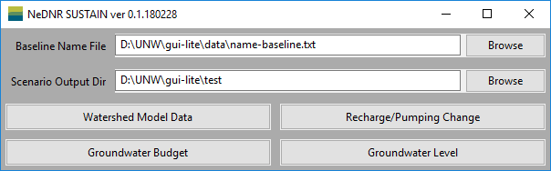
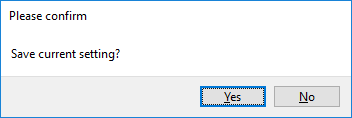

Configuration Window
======================

The ``Configuration`` window is the first window that appears when the application starts. The settings ``Baseline Name File`` and ``Scenario Output Dir`` need to be specified to have SUSTAIN properly operated.

* ``Baseline Name File`` is the file path of the SUSTAIN name file, which includes the information to run the models # (See :doc:`../files/name`).
* ``Scenario Output Dir`` defines the output directory of the current analysis. All the new model input and output files generated will be placed in this directory.
.. If the model is completed, *SUSTAIN* will read the model results in this directory.

When the ``Configuration`` window starts, it will load the configuration file ``config.ini`` # (See :doc:`../files/config`) in the same directory of the application. The configuration file includes the saved settings of ``Baseline Name File`` and ``Scenario Output Dir``.

There are four buttons in the ``Main`` window. Each button will open a new window with different functions. These windows are introduced as follows.

When the ``Main`` window is closed, a dialog window will pop up to provide the option to save the current settings to the configuration file. Though it is not recommended, experienced user can also modify the ``config.ini`` file using text editing tools.

