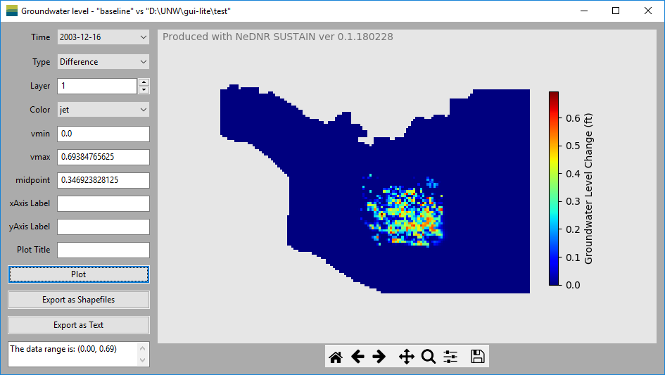

Groundwater Level
==================

The ``Groundwater Level`` window display the simulated groundwater levels based on the groundwater model output file.

* **Data area**

  - ``Time`` specify the time of the groundwater levels for the plot.
  - ``Type`` control which data to be used to plot. It includes the baseline groundwater levels, scenario groundwater levels and the groundwater level difference between the baseline and scenario.
  - ``Layer`` specify the model layer of the groundwater levels for the plot.

* **Plot control area** include controls to customize the plots.

  - ``vmin`` and ``vmax`` are the minimum and maximum values used to define the colors in the plot. When the groundwater level data is changed, the program will calculate these values and show them in the textboxes. The data range is also shown in the textbox at the bottom. These values can also be modified after the plot is made in order to, for example, decrease the range to show higher color variability.
  - ``xAxis Label`` make change to the title of the x-axis of the plot.
  - ``yAxis Label`` make change to the title of the y-axis of the plot.
  - ``Plot Title`` make change to the plot title.
  - ``Plot`` make the plot based on the selected data and options.
  - ``Export as Shapefiles`` export the groundwater levels as shapefiles for further spatial analysis using GIS tools such as ArcMap.
  - ``Export as Text`` export the groundwater levels to a ascii text file.

* **Plotting area** is on the right of the window. It includes the plotting figure and the navigation tool bar.

- ``Plotting figure`` occupy the most plotting area. When user resize the window, the size of the plotting figure will change accordingly.
- ``Navigation tool bar`` at the bottom of the plotting area control the view of the figure. The detailed usage of each button can be found on this page: https://matplotlib.org/users/navigation_toolbar.html.

