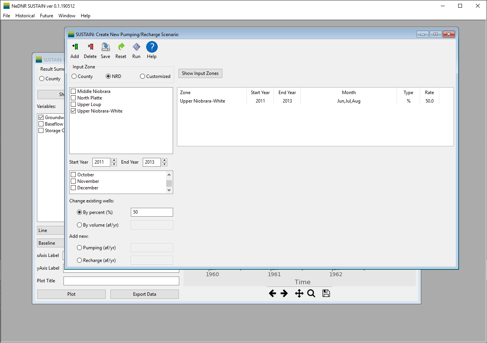

Recharge/Pumping Change
=======================

The Recharge/Pumping Change Window provides a very versatile tool to change the groundwater recharge and pumping through the WELL package of MODFLOW. It can create new MODFLOW input files based on the recharge or pumping changes you make.

* **Menu** includes the command buttons that you can used.

  - ``Add`` add the current change to the change table on the right of the window.
  - ``Delete`` can used to remove a change row from the change table.
  - ``Save`` transform all the changes in the change table into MODFLOW input files. When all the files are created, user will be asked whether to run the model.
  - ``Reset`` delete all the changes in the change table at once.
  - ``Run`` activate the MODFLOW run using the new input files.

  - ``Help`` show a description of how to make changes in pumping and recharge.

* **Selection area** provides options to specify where and when the changes to be made.

  - ``Input Zone`` select what spatial division of recharge/pumping you want to make change with. For example, if the *NRD* option is selected, the changes will be made in the selected NRD areas. The customized zone allows users select an existing zone file or shapefiles to define the input zone. Please see the Customized Zone section.
  - ``Start Year`` and ``End Year`` specify the years for the change. Please note that the change rate is constant over the selected years for each respective change.
  - ``Month`` filtering block specify the months for the change. The annual change rate will be equally distributed by the numbers of days in the selected months.

* **Modification area** provides two approaches to modify pumping and recharge by changing existing pumping wells or add new pumping/recharge wells. The textbox will be activated after users pick the modification approach.

  - `Change existing wells` will modify the pumping rates of the existing wells in the selected zones by `percentage` or by `volume` provided in the textbox next to it.
    The volume in acrefeet/yr will be equally distributed among the wells in the selected zones and time.

  - `Add new wells` will add new wells to each individual grid cell in the selected zones for new pumping or recharge.
    The volume specified in the textbox next to this option will be distributed to the cells in the selected zones.

* **Change table** display the changes added by users. Please note that, the changes are made subsequently. Therefore, the changes will be superimposed according to the modification table.

