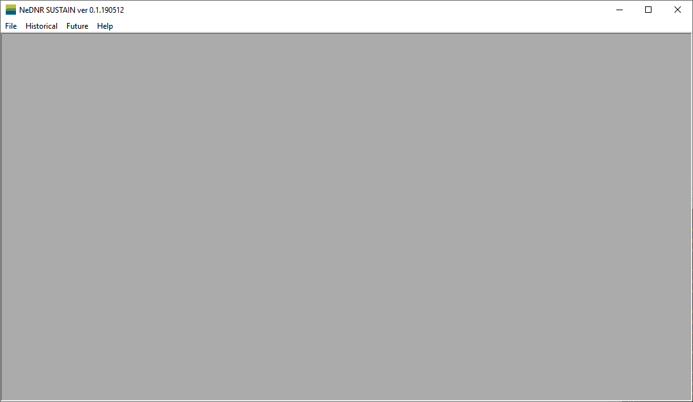

Main Window
======================

The ``Main`` window is the first window that appears when the application starts.

It is the container for all other windows using the Multiple Document Interface (MDI) framework.

There are four buttons in the ``Main`` window. Each button will open a new window with different functions. These windows are introduced as follows.

