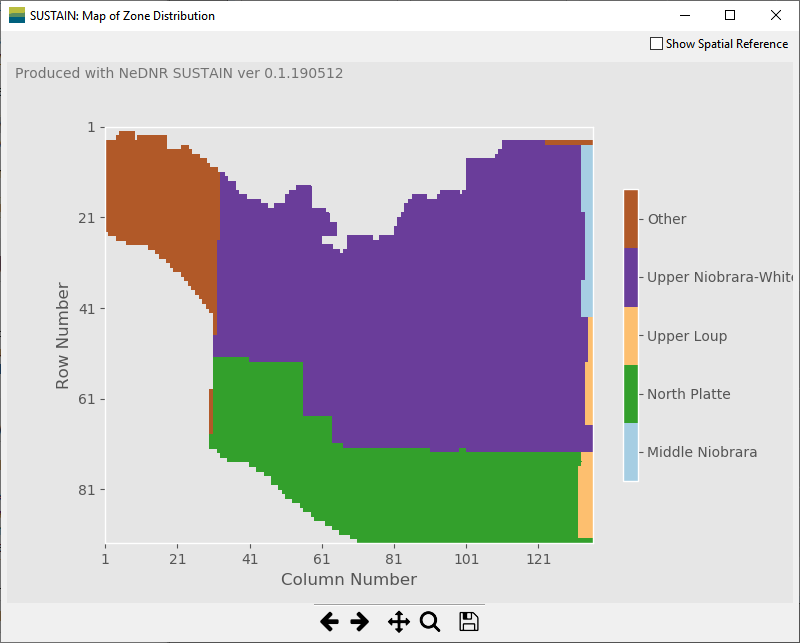

Zone Plot Window
====================

The ``Zone Plot`` window shows the map of zone distribution used to summarize the gridded model input or output data.

``Show Spatial Reference`` sets whether to include the georeferencing points in the zone plot (see :doc:`../files/name`).

