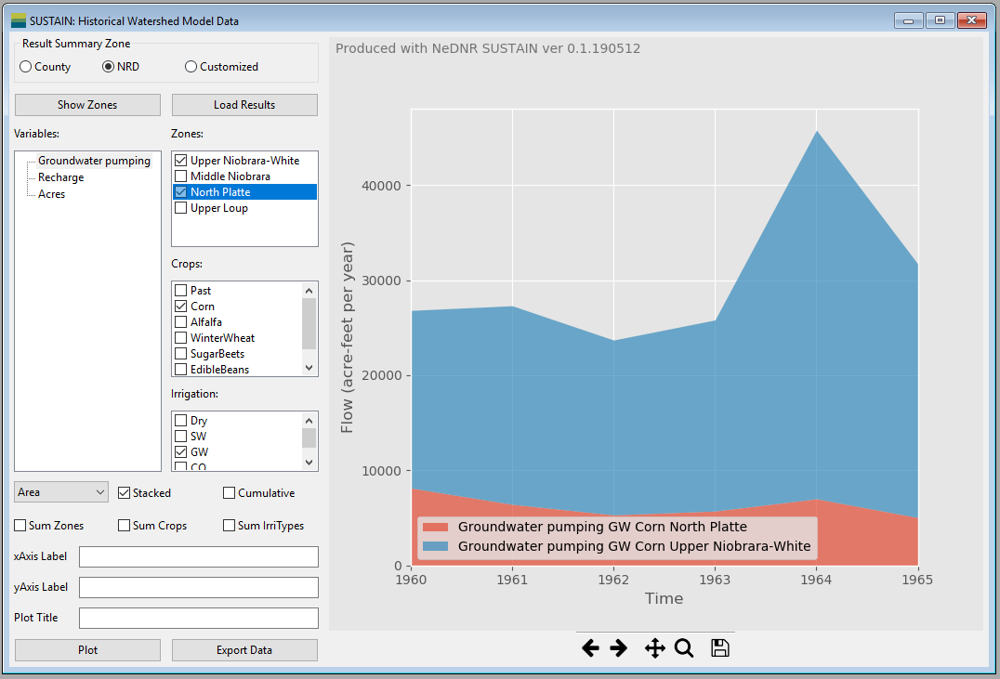

Watershed Model Data
====================

The ``Watershed Model Data`` window shows watershed model data including land use, and groundwater pumping and recharge estimated with the watershed model ``CropSim``.

* **Data zonation area**

..  * ``Output Zone`` select the spatial division of the data to be summarized. For example, if the *NRD* option is selected, the model results are aggregated in each NRD. The customized zone allows users select an existing zone file or shapefiles to define the output zone. Please see the Customized Zone section.

  * ``Show Zones`` activate a new window displaying the distribution map of the selected output zones (See :doc:`../windows/showZone`).
  * ``Load Results`` load the results from the model files and calculate the pumping, recharge and land cover area for each output zone. It can take a while and the program will be frozen during the reading process.

* **Selection area** provide the filtering function on the data. Users can select specific variable, zone, crop type and irrigation type for plotting or export. In each selection block, one or more items can be selected. To select multiple items, press the *Ctrl* when clicking the items or check the boxes. If no item is selected when plotting, the program assumes that all the items are selected (no filtering).

  * ``Variables Selection Block`` provide the option of variables to be plotted or exported. Currently, user can select annual groundwater pumping, groundwater recharge or/and land use acres.
  * ``Zones Selection Block`` provide the option of zones to be plotted or exported. The items provided in this block will change when the output zone is changed.
  * ``Crops Selection Block`` provide the option of crop types to be plotted or exported. The items in this block depends on the crop types used in the waterhsed model and usually include corn, pasture (past), sugar beets, edible beans, alfalfa, winter wheat and soybean.
  * ``Irrigation Selection Block`` selection block provides the option of irrigation types to be plotted or exported. There are four irrigation types including dryland (no irrigation), groundwater irrigated, surface water irrigated and commingle irrigated.

* **Plot control area** include controls to customize the plots.

  - ``Plot type`` control if the data are plotted as lines, bars or areas.
  - ``Stacked Checkbox`` stack the bar and area plots. Note that the bar and area plots will be stacked based on all other dimensions except the time.
  - ``Cumulative Checkbox``  plot the cumulative values instead of the annual values.
  - ``Sum Zones Checkbox`` sum the values based on zones. For example, if the user want to plot the total pumping in Box Butte and Cherry counties, the user can select *Groundwater pumping* and these two counties for data, and check this ``Agg.Zones`` checkbox.
  - ``Sum Crops Checkbox`` is similar to ``Sum Zones`` but it sums over crop types instead of zones.
  - ``Sum IrrTypes Checkbox`` is similar to ``Sum Zones`` but it sums over irrigation types instead of zones.
  - ``xAxis Label`` make change to the title of the x-axis of the plot.
  - ``yAxis Label`` make change to the title of the y-axis of the plot.
  - ``Plot Title`` make change to the plot title.
  - ``Plot`` make the plot based on the selected data and options.
  - ``Export Data`` export the plotting data as a spreadsheet. Note that the plotting data can saved only after they are plotted.

* **Plotting area** is on the right of the window. It includes the plotting figure and the navigation tool bar.

  - ``Plotting figure`` occupy the most plotting area. When user resize the window, the size of the plotting figure will change accordingly.
  - ``Navigation tool bar`` at the bottom of the plotting area control the view of the figure. The detailed usage of each button can be found on this page: https://matplotlib.org/users/navigation_toolbar.html.

